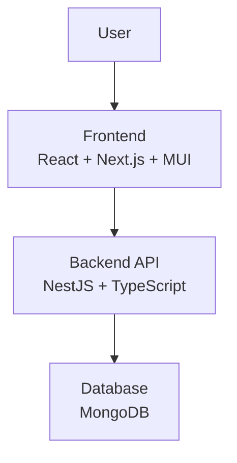
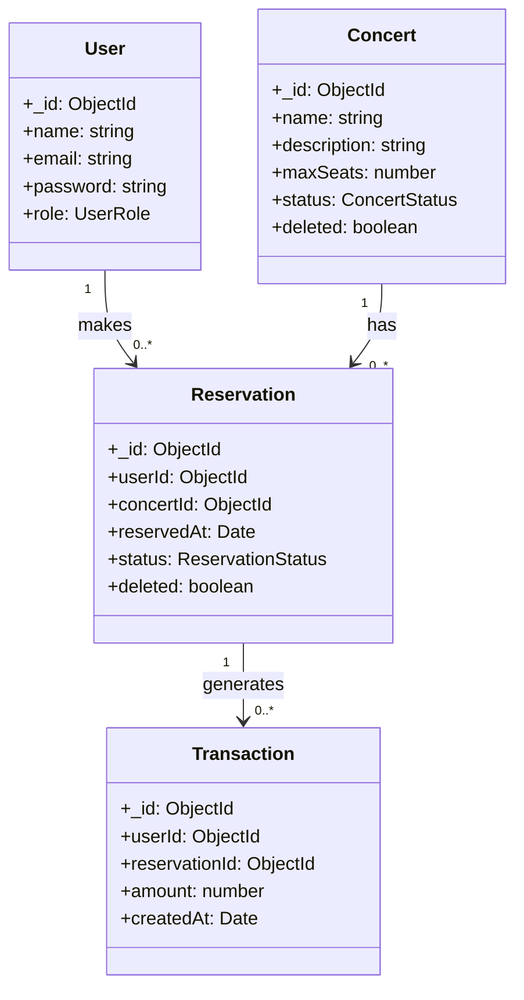

# Concert Tickets Project

## Setup Project
### Backend Setup

```bash
# Clone backend repository
git clone https://github.com/areeyaswnth/concert_tickets-backend.git
cd concert_tickets-backend

# Copy environment file
cp .env.example .env.local

# Install dependencies
npm install

# Start backend server (development mode)
npm run start:dev

#cli for create user
curl -X POST http://localhost:3000/api/v1/user/auth/register \
-H "Content-Type: application/json" \
-d '{
  "name": "Admin User",
  "email": "admin@example.com",
  "password": "securepassword",
  "role": "admin"
}'

```
### Frontend Setup
```
# Clone frontend repository
git clone https://github.com/areeyaswnth/concert_tickets.git
cd concert_tickets

# Copy environment file
cp .env.local .env

# Install dependencies
npm install

# Start frontend server (development mode)
npm run dev
```
---
## Architecture Overview
## 

### Class Diagram


### API
**Concerts** (`/api/v1/concerts`)
1. `POST /create` – Create a new concert
2. `PATCH /:id/cancel` – Cancel a concert
3. `GET /list` – Get all concerts
4. `GET /:id` – Get concert details
5. `PUT /:id` – Update a concert
6. `DELETE /:id` – Delete a concert

**Users** (`/api/v1/user`)
1. `POST /auth/register` – Register a new user
2. `POST /auth/login` – Login
3. `GET /auth/me` – Get current logged-in user info
4. `GET /list` – Get all users
5. `GET /:id` – Get user details
6. `PUT /:id` – Update user
7. `DELETE /:id` – Delete user

**Reservations** (`/api/v1/reserve`)
1. `POST /:userId/:concertId` – Reserve a concert
2. `DELETE /:userId/:concertId` – Cancel a concert reservation
3. `GET /dashboard` – Get reservation dashboard

**Transactions** (`/api/v1/transactions`)
1. `GET /list` – Get all transactions

---
## Lib And Framework

1. **NestJS**  
   - Used according to project requirements  And I have experience to use before
   - Purpose: Main framework for building a modular backend with support for Dependency Injection

2. **Mongoose**  
   - Use for connect to and manage MongoDB , Schema has validation and supports `populate`  
  
3. **bcrypt**  
   - Hash user passwords to Increases security when storing passwords

4. **passport / passport-jwt / @nestjs/jwt**  
   - Purpose: Authentication and authorization using JWT  for ensures secure login and user role management

5. **ts-jest / jest / supertest**  
   - Write and run Unit Tests to verify the functionality of Services 

6. **mongodb-memory-server**  
   - Purpose: Create a temporary MongoDB instance for testing  and that's allows tests to run without affecting the real database
---
## Run units Test
```bash
# Run  unit tests
npm run test
```
### Test Case
### UsersService Test Cases

1. **Create and Find User**  
   - Test creating a user with `create()` and retrieving it with `findOne()`.  
   - Validates that the user is stored correctly in the database and can be retrieved.

2. **Register User and Return Access Token**  
   - Test the `register()` method to create a user and generate a JWT access token.  
   - Checks that the returned object contains both `user` and `access_token` properties, and the role is correct.

3. **Login Existing User**  
   - Test the `login()` method with an existing user.  
   - Verifies that the login succeeds and returns a valid `access_token` along with the correct role.

4. **User Not Found Exception**  
   - Test `findOne()` with a non-existent user ID.  
   - Ensures that a `NotFoundException` is thrown when the user does not exist.

### TransactionsService Test Cases

1. **Service Definition**  
   - Verifies that the `TransactionsService` is defined and can be instantiated.

2. **Create Transaction**  
   - Tests `createTransaction()` with a valid `CreateTransactionDto`.  
   - Ensures the created transaction matches the input data.

3. **Find All Transactions**  
   - Tests `findAll()` after creating multiple transactions.  
   - Verifies that all transactions are returned.

4. **Find Transactions by Reservation ID**  
   - Tests `findByReservation(reservationId)` with a specific reservation ID.  
   - Ensures only transactions with the matching `reservationId` are returned.

5. **Paginate All Transactions**  
   - Tests `getAllTransactions(page, limit)` with multiple transactions.  
   - Verifies correct pagination, total count, and number of pages.

6. **Paginate Transactions by User ID**  
   - Tests `getUserTransactions(userId, page, limit)` for a specific user.  
   - Verifies correct user-specific pagination, total count, and number of pages.

### ConcertsService Test Cases

1. **Service Definition**
   - Verifies that `ConcertsService` is defined and can be instantiated.

2. **Create Concert**
   - Tests `create()` with valid concert data.
   - Ensures the returned concert has a generated `_id` and matches the input.

3. **Get Concert by ID**
   - Tests `findOne(id)` for an existing concert.
   - Verifies the correct concert is returned.
   - Should throw `NotFoundException` if the concert does not exist.

4. **Get All Concerts**
   - Tests `findAll()` or `getAllConcerts()` method.
   - Ensures all concerts in the database are returned.

5. **Update Concert**
   - Tests `update(id, data)` to modify concert details.
   - Verifies the concert is updated correctly.

6. **Cancel Concert**
   - Tests `cancelConcert(id)` or equivalent.
   - Checks that the concert status changes to `CANCELED` or appropriate enum.
   - Optionally checks related reservations if your logic handles them.

7. **Delete Concert**
   - Tests `delete(id)` to remove a concert.
   - Verifies the concert is removed or marked as deleted.

8. **Reserve Seats / Transactions Integration**
   - Optionally tests integration with `TransactionsService` to create a transaction when a concert is created or updated.
   - Mocks `TransactionsService.createTransaction()` to verify it is called correctly.

9. **Pagination / Listing**
   - Tests methods that support pagination.
   - Ensures correct page, limit, total, and returned items.

10. **Edge Cases**
    - Creating a concert with missing required fields should throw an error.
    - Updating or deleting a non-existent concert should throw `NotFoundException`.

### ReservationsService Test Cases

1. **Service Definition**
   - Ensure `ReservationsService` is defined.

2. **Reserve Seat**
   - Successfully reserve a seat for a user in a concert.
   - Throw `NotFoundException` if the concert does not exist.
   - Throw `BadRequestException` if the concert is full.
   - Throw `NotFoundException` if the user does not exist.
   - Throw `BadRequestException` if the concert is cancelled.
   - Throw `BadRequestException` if the user already has a reservation.

3. **Cancel Reservation**
   - Successfully cancel a reservation.
   - Throw `NotFoundException` if the user does not exist.
   - Throw `NotFoundException` if the concert does not exist.
   - Throw `NotFoundException` if the reservation does not exist.

4. **Get User Reservations**
   - Return all reservations for a specific user.

5. **Get List of Reservations**
   - Return paginated reservations with populated user and concert data.
   - Default to `page=1` and `limit=10` if invalid values are provided.
   - Return correct `totalPages` when total reservations are less than the limit.

6. **Get Dashboard Stats**
   - Correctly calculate `totalSeats`, `reservedCount`, and `cancelledCount`.

7. **Edge Cases**
   - Handle invalid IDs gracefully.
   - Ensure proper exceptions are thrown for missing entities or invalid operations.

## 1) When data is intensive and traffic increases
- **Pagination & Lazy Loading** → Do not load all data at once, fetch only the required page.
- **Caching** → Use CDN to reduce latency and cache static or less frequently changing data such as the concert list.
- **Database Optimization** → Write efficient queries and optimize logic to handle high-traffic scenarios.
- **Load Balancing & Horizontal Scaling** → Distribute traffic across multiple servers.
- **Asynchronous Processing** → Offload non-critical tasks to a message queue to prevent blocking main processes.

---

## 2) Handling many users reserving tickets at the same time (Concurrency Control)
- **Database Transaction** → Ensure atomic operations to prevent overselling seats.
- **Seat Locking System** → Temporarily lock seats when a user starts the reservation. If payment is not completed within a specific timeframe, release the seats back to the pool.
- **Optimistic Concurrency Control** → Use fields like `availableSeats` and update with conditions (e.g., `WHERE availableSeats > 0`) to avoid race conditions.
- **Queue System** → In high-demand concerts, use a queue to process reservations in batches, ensuring fairness and preventing system overload.
- **Real-time Updates** → Use WebSocket/Socket.IO to update seat availability in real-time so users always see the latest status.
